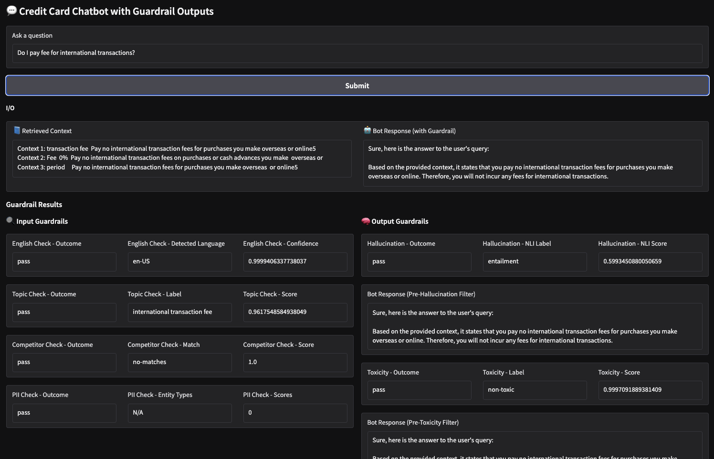

# LLM Guardrails for Financial Services Chatbots

This project demonstrates how to design and implement an LLM-powered **guardrail for groundedness** in chatbot responses. The solution is tailored for a **financial services** company to help customers learn about its products. In this example, the focus is on **credit cards**. The chatbot is English-only and must not respond to queries outside the defined product scope.

## 🧠 Purpose

The goal is to ensure chatbot responses are **reliable, consistent, and grounded** in approved content, meeting **industry expectations** for use in **highly regulated financial services**. The project also shows that these guardrails are straightforward to implement and evaluate.

## 📘 Notebooks

- `nb_1_guardrail_design.ipynb`  
  Walks through the design rationale, groundedness criteria, and how each guardrail aligns with industry standards and enterprise constraints. It also discusses limitations and fine-tuning strategies.

- `nb_2_guardrail.ipynb`  
  Brings the solution to life in an interactive RAG-based chatbot. You can send real prompts and observe how the guardrails behave **in real time** (no dummy responses or artificial examples). This allows you to directly experience and evaluate how effectively the guardrails detect undesired queries and ungrounded responses.

## ✅ Features

- Prompt-engineered, RAG-based implementation
- 30 test cases for functional evaluation
- Quantitative and qualitative metrics for each guardrail
- Clean, modular, and integration-ready code
- Aligned with industry best practices
- Friendly UI for hands-on testing of groundedness in real time

## 📊 Evaluation

- Notebook 1 includes tests that demonstrate each guardrail’s **functionality, quality, and limitations** using realistic examples. Both accepted and rejected cases are shown.
- The groundedness of 30 test cases was evaluated by the repo author and GPT-4o, and the results were compared against the guardrail outputs (for hallucination only). Findings are documented in an Excel file in the `data` folder.

## 🖼️ Demo

  

---

## 🚀 How to Run

Run both notebooks sequentially in **Google Colab** for the best experience.  
Each notebook includes clear setup instructions and is designed for ease of use.
